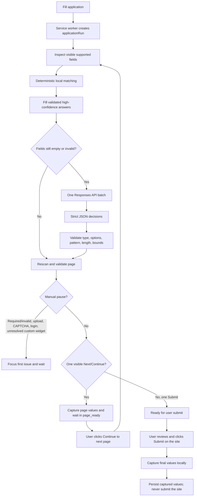
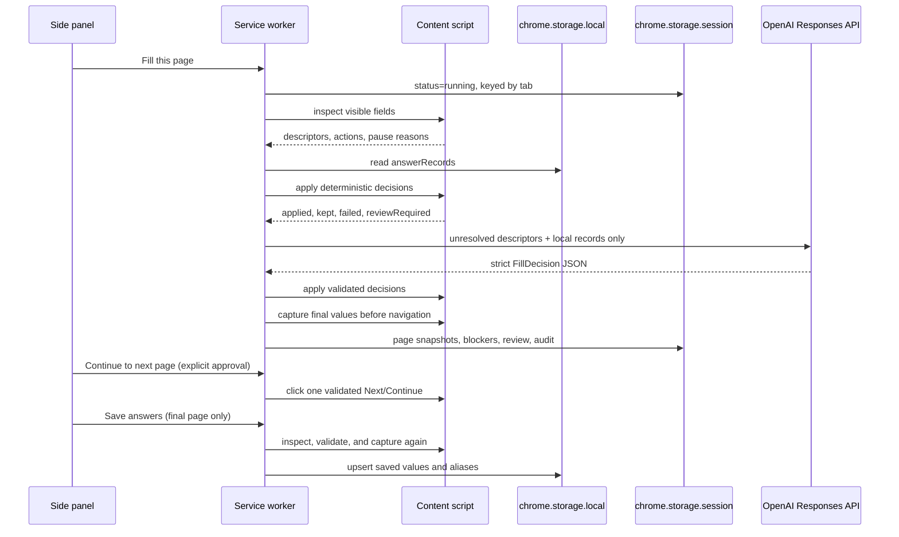
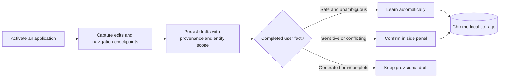

# Job Application Autofill

A personal Manifest V3 Chrome extension that fills job forms quickly from a local answer profile, asks an OpenAI model only about unresolved fields, and learns from values you explicitly save after review.

## Saved-answer reuse

Questions are extracted from native labels/ARIA or a bounded local wrapper, including Lever sibling headings and radio groups. Descriptors include label origin and confidence. Question wording is canonicalized at lookup; persisted source keys are not bulk-renamed.

Related narrative evidence and review-sensitive equivalents appear beside unresolved fields with the source question, provenance, full saved answer, **Use this saved answer**, and **Edit and use**. No API key is needed. Approval is bound to the originating tab, frame, application, page signature and live control handle. Changed sources, replaced controls, changed options, nonempty destinations and invalid constraints reject approval. The page value and reusable save are read back before success is reported. Submission remains manual.

Confirmed semantic-equivalent reuse adds an alias to its stable source. Edited or recomposed answers create a separate record with evidence links. Prior completed user drafts appear as **Previously entered, not yet saved for reuse**; scanning never promotes them. Legacy unmarked narratives are explicitly shown as unconfirmed evidence. Unsupported experience thresholds and qualifications remain manual; general ML evidence never establishes pharma experience.

Compensation current/expected, component, currency, period and scale are protected. A generic free-text CTC field can offer an intact LPA explanation for approval; it does not guess units, convert numbers, or infer fixed/variable splits. Explicit incompatible units remain blocked.

Optional AI receives at most 20 locally relevant records, not the whole answer library. Fields already waiting on local saved-evidence approval are not sent to AI. Generated synthesis is not supported by the copy/transformation schema.

## Runtime flow



The page receives field descriptors and validated decisions, never the API key. The model cannot execute selectors or click controls.

### Generic custom controls

The form engine also recognizes visible semantic custom controls (`role="combobox"` or a listbox-triggering button) that belong to the application area. A selected value is treated like a normal select field, while an empty required choice pauses for the user. When a decision is available, the extension opens the control, waits briefly for asynchronously-rendered `role="option"` elements, and clicks only one exact text/value match. Ambiguous or non-semantic widgets remain manual so unfamiliar job sites do not depend on site-specific selectors.

## How fields and answers move



Embedded application forms are supported. When a tab contains multiple frames,
the worker inspects each frame locally, selects one deterministic application
frame, and routes the full run to that frame. Search, cookie, feedback, and
talent-community frames are never used for autofill. If no unique application
frame can be identified, the run pauses for manual completion.

## Local learning



Learning activates with **Fill this page**. Edits are debounced into application drafts; they are not automatically promoted into the reusable profile. **Save answers** or a saved-evidence approval is the explicit checkpoint. Provisional autofill and unreliable question labels remain ineligible for automatic confirmation. Datasource writes are serialized across tabs, and scoped legacy records and backups preserve separate entries and alternatives.

The initial profile is bundled separately in `data/seed-data.json`, extracted from `resume.xlsx`, and imported only when the live datasource is empty. The live `answerRecords`, cover-message templates, and datasource metadata are stored in `chrome.storage.local`; extension updates never replace them. The side panel provides JSON export and non-destructive import for backups.

The workbook seed contains the profile links from `Sheet1`, answered rows from `common questions`, and the `email` sheet as a reviewed cover-message template. The first Twitter URL is the autofill value and the second URL is retained as an alternative.

## Data sent to the model

At most one request is made per page, and only when local answers do not cover it. The request contains:

- page title and hostname;
- visible field descriptors: label, type, autocomplete, current value, options, required state, and HTML constraints;
- local learned answer records: canonical key, question, answer, aliases, type, and sensitivity.

It does not contain raw HTML, hidden inputs, passwords, cookies, URLs with query strings, or the API key. The model must use evidence from the supplied records and return `ask_user` when evidence is missing or ambiguous. Failed API calls fall back to local fills and a manual pause.

The extension uses the configured AI provider and answer-planner model. Fireworks is the default provider with model `accounts/fireworks/models/glm-5p3-flash`; OpenAI remains available as an alternative. Fireworks requests use the OpenAI-compatible Chat Completions endpoint and JSON output mode. The provider, model ID, and provider-specific API keys are held in trusted `chrome.storage.local` and read only by the extension side panel/service worker.

## Install and use

1. Run `npm install`, then `npm run build`.
2. Open `chrome://extensions`, enable Developer mode, and choose **Load unpacked**.
3. Select `C:\Users\nithi\job-application-autofill-extension`.
4. Open a job application and open the extension side panel.
5. Open **Settings & data**, choose Fireworks or OpenAI, enter that provider’s API key, and select or type a compatible model ID. Local deterministic filling works without a key.
6. Click **Fill this page**. Complete any highlighted required fields or manual steps, then click **Check again**.
7. When a page is ready, review it and click **Continue to next page**. On the final page, review the form and submit through the application site; the extension captures the final values automatically. **Save answers** remains available as an optional local checkpoint.

When updating the unpacked extension, preserve unsaved form values before any browser operation. Run `npm run build`, reload the extension card (not the application page), and reopen the panel. The content PING reports version `general-reuse-1`; verify this before using the new feature on an existing page. Reinjecting the same version is tested to preserve values and avoid duplicate listeners. The old boolean installation guard cannot safely dispose legacy listeners: if the old script still responds without the version, stop rather than resetting its guard or reloading an unsaved application. Legacy live hot-upgrade requires separate browser verification; the automated build is not proof that an already-open tab is updated.

Activated applications incrementally extend the local profile. Later equivalent questions reuse compatible confirmed answers. First, full, last, and preferred names remain distinct; full names can be composed from unambiguous first and last names. Ambiguous dates, unsupported transformations, conflicting records, and unmatched employment or education entities remain unresolved for review.

## Boundaries

- Resume uploads, CAPTCHA, login, inaccessible shadow-root controls, and ambiguous or non-semantic custom widgets remain manual pause points. Embedded frames are supported when their controls are accessible to the extension.
- Automation is limited to the active tab and stops after 20 pages.
- Final submission is always performed by the user through the application site; the extension never clicks Submit.
- This personal unpacked extension uses a direct API key. A public distribution should move model calls behind a backend.

## Development

```powershell
Set-Location C:\Users\nithi\job-application-autofill-extension
npm install
npm run build
npm test
npm run check
```

The build combines the core, form engine, learning controller, and content bridge into `dist/content.js`, a classic script suitable for runtime injection.

The suite includes synthetic Workday, Lever, and Ashby fixtures for repeated history, searchable dropdowns, multiple selections, and delayed navigation. These model representative markup and behavior; they are not captured live vendor pages. Live Chrome/ATS compatibility has not been verified in this implementation session because the browser automation bridge was unavailable. Reload the extension and application tabs after rebuilding to use the new bundle.

## Demo form

Serve the repository over HTTP:

```powershell
Set-Location C:\Users\nithi\job-application-autofill-extension
python -m http.server 8765
```

Then open [http://127.0.0.1:8765/examples/demo-form.html](http://127.0.0.1:8765/examples/demo-form.html). The two-step demo covers text, select, radio, long-form, required fields, a file-upload pause, Next navigation, submission, and second-run learning.

See [PRIVACY.md](PRIVACY.md) for storage and model-data handling.
