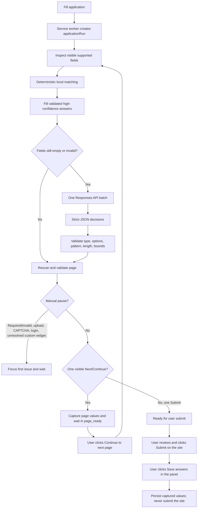
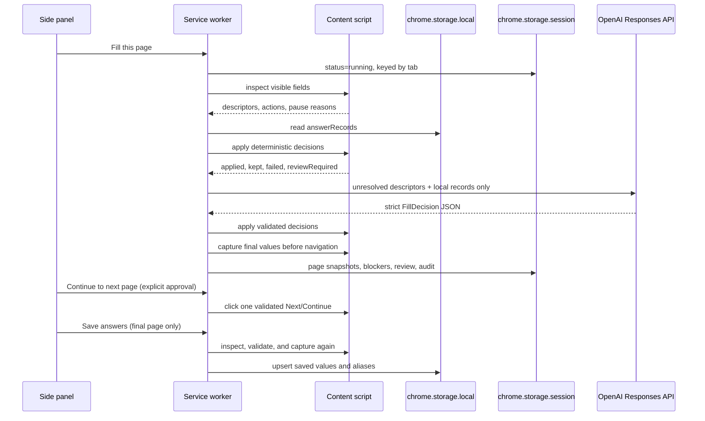
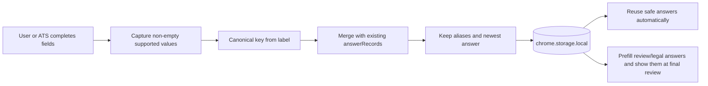

# Job Application Autofill

A personal Manifest V3 Chrome extension that fills job forms quickly from a local answer profile, asks an OpenAI model only about unresolved fields, and learns from values you explicitly save after review.

## Runtime flow



The page receives field descriptors and validated decisions, never the API key. The model cannot execute selectors or click controls.

### Generic custom controls

The form engine also recognizes visible semantic custom controls (`role="combobox"` or a listbox-triggering button) that belong to the application area. A selected value is treated like a normal select field, while an empty required choice pauses for the user. When a decision is available, the extension opens the control, waits briefly for asynchronously-rendered `role="option"` elements, and clicks only one exact text/value match. Ambiguous or non-semantic widgets remain manual so unfamiliar job sites do not depend on site-specific selectors.

## How fields and answers move



Embedded application forms are supported. When a tab contains multiple frames,
the worker inspects each frame locally, selects one deterministic application
frame, and routes the full run to that frame. Search, cookie, feedback, and
talent-community frames are never used for autofill. If no unique application
frame can be identified, the run pauses for manual completion.

## Local learning



Learning has no separate mode or queue. Saving happens only after the explicit final **Save answers** action. Existing `answerRecords` are normalized during migration; obsolete source configuration and pending queues are discarded.

The initial profile is bundled separately in `data/seed-data.json`, extracted from `resume.xlsx`, and imported only when the live datasource is empty. The live `answerRecords`, cover-message templates, and datasource metadata are stored in `chrome.storage.local`; extension updates never replace them. The side panel provides JSON export and non-destructive import for backups.

The workbook seed contains the profile links from `Sheet1`, answered rows from `common questions`, and the `email` sheet as a reviewed cover-message template. The first Twitter URL is the autofill value and the second URL is retained as an alternative.

## Data sent to the model

At most one request is made per page, and only when local answers do not cover it. The request contains:

- page title and hostname;
- visible field descriptors: label, type, autocomplete, current value, options, required state, and HTML constraints;
- local learned answer records: canonical key, question, answer, aliases, type, and sensitivity.

It does not contain raw HTML, hidden inputs, passwords, cookies, URLs with query strings, or the API key. The model must use evidence from the supplied records and return `ask_user` when evidence is missing or ambiguous. Failed API calls fall back to local fills and a manual pause.

The extension uses `gpt-5.6-terra` with low reasoning effort, `store: false`, and strict JSON Schema output. The API key is held in trusted `chrome.storage.local` and read only by the extension side panel/service worker.

## Install and use

1. Run `npm install`, then `npm run build`.
2. Open `chrome://extensions`, enable Developer mode, and choose **Load unpacked**.
3. Select `C:\Users\nithi\job-application-autofill-extension`.
4. Open a job application and open the extension side panel.
5. Enter an OpenAI API key if you want unresolved-field assistance. Local deterministic filling works without it.
6. Click **Fill this page**. Complete any highlighted required fields or manual steps, then click **Check again**.
7. When a page is ready, review it and click **Continue to next page**. On the final page, review the form and click **Save answers** in the panel; submit only through the application site.

The first application whose values you save updates the local profile. Later semantically equivalent forms reuse those answers. Safe answers can fill without review; medium-confidence, long-form, review, and legal answers remain visible in final review.

## Boundaries

- Resume uploads, CAPTCHA, login, inaccessible shadow-root controls, and ambiguous or non-semantic custom widgets remain manual pause points. Embedded frames are supported when their controls are accessible to the extension.
- Automation is limited to the active tab and stops after 20 pages.
- Final submission is always performed by the user through the application site; the extension never clicks Submit.
- This personal unpacked extension uses a direct API key. A public distribution should move model calls behind a backend.

## Development

```powershell
Set-Location C:\Users\nithi\job-application-autofill-extension
npm install
npm run build
npm test
npm run check
```

The build combines the tested core, form engine, and content bridge into `dist/content.js`, a classic script suitable for runtime injection.

## Demo form

Serve the repository over HTTP:

```powershell
Set-Location C:\Users\nithi\job-application-autofill-extension
python -m http.server 8765
```

Then open [http://127.0.0.1:8765/examples/demo-form.html](http://127.0.0.1:8765/examples/demo-form.html). The two-step demo covers text, select, radio, long-form, required fields, a file-upload pause, Next navigation, submission, and second-run learning.

See [PRIVACY.md](PRIVACY.md) for storage and model-data handling.
