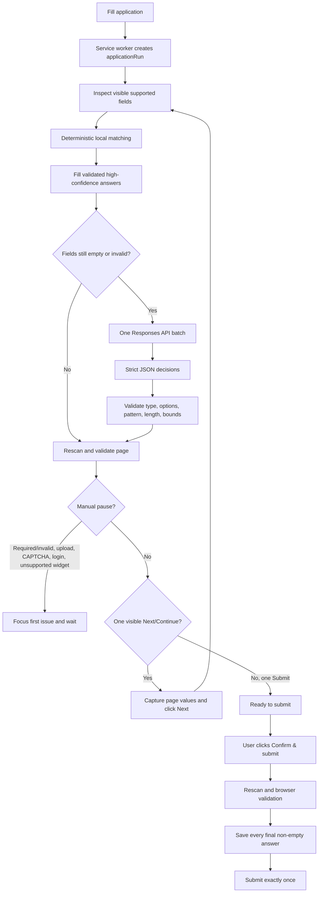
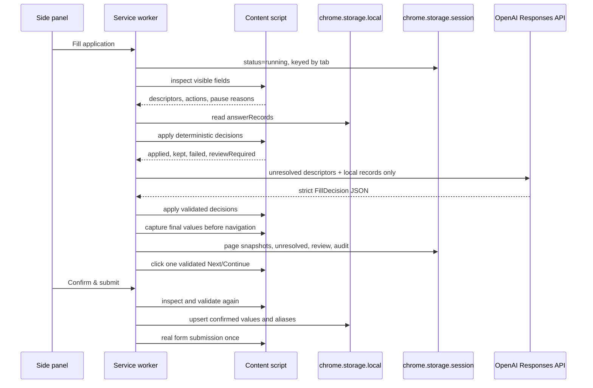
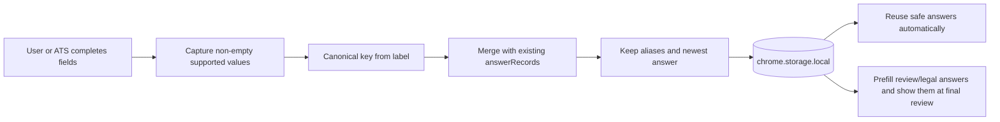

# Job Application Autofill

A personal Manifest V3 Chrome extension that fills job forms quickly from a local answer profile, asks an OpenAI model only about unresolved fields, and learns from the values you confirm at submission.

## Runtime flow



The page receives field descriptors and validated decisions, never the API key. The model cannot execute selectors or click controls.

## How fields and answers move



## Local learning



Learning has no separate mode or queue. Saving happens only after the explicit final confirmation. Existing `answerRecords` are normalized during migration; obsolete source configuration and pending queues are discarded.

## Data sent to the model

At most one request is made per page, and only when local answers do not cover it. The request contains:

- page title and hostname;
- visible field descriptors: label, type, autocomplete, current value, options, required state, and HTML constraints;
- local learned answer records: canonical key, question, answer, aliases, type, and sensitivity.

It does not contain raw HTML, hidden inputs, passwords, cookies, URLs with query strings, or the API key. The model must use evidence from the supplied records and return `ask_user` when evidence is missing or ambiguous. Failed API calls fall back to local fills and a manual pause.

The extension uses `gpt-5.6-terra` with low reasoning effort, `store: false`, and strict JSON Schema output. The API key is held in trusted `chrome.storage.local` and read only by the extension side panel/service worker.

## Install and use

1. Run `npm install`, then `npm run build`.
2. Open `chrome://extensions`, enable Developer mode, and choose **Load unpacked**.
3. Select `C:\Users\nithi\job-application-autofill-extension`.
4. Open a job application and open the extension side panel.
5. Enter an OpenAI API key if you want unresolved-field assistance. Local deterministic filling works without it.
6. Click **Fill application**. Complete any highlighted required fields or manual steps, then click **Continue**.
7. Review the attention list and visible form. Click **Confirm & submit** once the final page is ready.

The first confirmed application seeds the local profile. Later semantically equivalent forms reuse those answers. Safe answers can fill without review; medium-confidence, long-form, review, and legal answers remain visible in final review.

## Boundaries

- Resume uploads, CAPTCHA, login, cross-origin iframes, shadow-root controls, and ambiguous custom widgets remain manual pause points.
- Automation is limited to the active tab and stops after 20 pages.
- Final submission always requires one explicit user confirmation.
- This personal unpacked extension uses a direct API key. A public distribution should move model calls behind a backend.

## Development

```powershell
Set-Location C:\Users\nithi\job-application-autofill-extension
npm install
npm run build
npm test
npm run check
```

The build combines the tested core, form engine, and content bridge into `dist/content.js`, a classic script suitable for runtime injection.

## Demo form

Serve the repository over HTTP:

```powershell
Set-Location C:\Users\nithi\job-application-autofill-extension
python -m http.server 8765
```

Then open [http://127.0.0.1:8765/examples/demo-form.html](http://127.0.0.1:8765/examples/demo-form.html). The two-step demo covers text, select, radio, long-form, required fields, a file-upload pause, Next navigation, submission, and second-run learning.

See [PRIVACY.md](PRIVACY.md) for storage and model-data handling.
