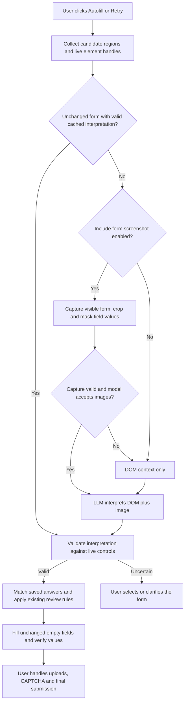

# Visual Form Interpretation Implementation Plan

> **For agentic workers:** REQUIRED SUB-SKILL: Use superpowers:executing-plans to implement this plan task-by-task. Steps use checkbox (`- [ ]`) syntax for tracking. Use the installed executing-plans skill; execution does not require subagents.

**Goal:** Let an LLM interpret application forms from DOM context and an optional screenshot, with screenshot context enabled by default.

**Architecture:** On an explicit Autofill or Retry scan, collect candidate form regions before semantic filtering, then ask the configured LLM to interpret their fields and actions. Include a locally cropped and masked screenshot when enabled and supported. Validate the interpretation against live element handles before passing it into the existing answer matching, review, and fill pipeline.

**Tech Stack:** Existing Manifest V3 extension, JavaScript modules, Chrome extension APIs, existing provider adapters, Node test runner and jsdom. No new runtime dependency.

## Global Constraints

- Screenshot context is configurable and on by default, including when existing installations have no stored preference. An explicit false must remain false.
- One new user setting: `includeFormScreenshot`. Reuse existing AI provider, model, and credentials.
- Form interpretation runs once per new form structure during explicit Autofill/Retry; unchanged forms reuse a validated, in-memory interpretation. Focus alone does not start image capture or interpretation.
- Screenshot OFF means DOM-only LLM interpretation, not disabling the existing answer AI.
- No API key: retain local supported-form filling and show configuration guidance for forms requiring interpretation. No new provider is silently selected.
- A model's image support must be verified through its provider contract; do not infer support from its name or assume the current default supports vision.
- Page text and image content are untrusted data. The model may return only references to supplied elements, meanings, and action roles; never selectors, executable code, or new candidate facts.
- Existing-answer preservation, factual evidence requirements, sensitive-answer review, site enablement, document/frame authority, and explicit final submission remain enforced in code.
- Never classify a known native submit/image control as safe automatic Next solely because of an LLM answer. Retain existing navigation validation; new uncertain navigation requires user action.
- Screenshot scope is the visible part of candidate forms/dialogs and their headings. No automatic scrolling or full-page stitching in this version.
- Strip field values from interpretation DOM data. Mask nonempty editable-control pixels locally, including password/file/contenteditable controls. Mask inaccessible iframe content. If crop/redaction cannot be validated, send DOM only.
- Masking editable fields does not guarantee that all personal information in surrounding text is removed. Setting copy must disclose sending the visible form to the selected AI provider without claiming complete anonymization.
- Keep image data transient; exclude it from Chrome storage, backups, run history, logs, and interpretation cache. This is a local storage guarantee, not a claim about provider retention.
- Implementation estimate: 90–140 minutes, including regression checks and a live browser check.

## Flow



## Files and contracts

- Modify `sidepanel.html` and `src/sidepanel.js`: toggle, persistence, and compact interpretation status.
- Modify `src/service-worker.js`: preference default, orchestration, active-tab checks, interpretation validation/cache, and existing pipeline integration.
- Modify `src/form-engine.js` and `src/content.js`: candidate collection, frame-local DOM metadata, bounding rectangles, authoritative handles, and guarded application of interpretations.
- Modify `src/llm.js`: a separate `callFormInterpreter` operation sharing current provider transport, timeout, and JSON parsing conventions. Do not turn the answer planner into a browser controller.
- Create `src/form-screenshot.js`: crop/redaction processing of captured pixels using built-in image/canvas facilities; transient only.
- Modify `tests/sidepanel.test.js`, `tests/service-worker.test.js`, `tests/llm.test.js`, `tests/form-engine.test.js`, and `tests/bundle-runtime.test.js`; create `tests/form-screenshot.test.js` for geometry and failure cases.
- Add `tests/fixtures/ycombinator.html`, reduced from the observed form with synthetic/empty data. Rebuild `dist/content.js` through `npm run build`.

Contract examples (these define proposed interfaces, not existing exports):

```js
// Input to callFormInterpreter({apiKey, snapshot, screenshot}, providerOptions).
const snapshot = {
  documentId: 'doc-1', signature: 'structure-1',
  regions: [{
    frameId: 0, regionId: 'region-1', heading: 'Apply to Vahan',
    fields: [{handle: 'field-1', tag: 'input', type: 'text',
      label: '', placeholder: 'First Name *', required: false}],
    actions: [{handle: 'action-1', label: 'Send Message', type: 'submit'}],
  }],
};
// Output: strict schema, all references resolved against this request snapshot.
const interpretation = {
  status: 'ready', // ready | needs_user | not_application
  frameId: 0, regionId: 'region-1',
  fields: [{handle: 'field-1', meaning: 'first_name',
    question: 'First Name', required: true}],
  actions: [{handle: 'action-1', role: 'final_submit'}],
  reason: 'Applicant details inside the Apply to Vahan dialog.',
};
// screenshot is null or {dataUrl, viewport, capturedAt}; omit it on DOM-only calls.
```

The model may provide a normalized question for unfamiliar fields; it cannot mark evidence confirmed or relax the core fill policy. Image coordinates support interpretation only. All writes target existing element handles.

## Task 1: Persist the screenshot preference (10–15 minutes)

- [ ] Add side-panel and worker tests for missing preference => true, stored false => false, and persistence after toggling/reopening.
- [ ] Add the checkbox beside existing AI settings:

```html
<label class="checkbox-row" for="include-form-screenshot">
  <input id="include-form-screenshot" type="checkbox">
  Include form screenshot
</label>
<p class="muted">Helps AI understand the form layout. Sends the visible form to your selected AI provider. Turn off to use text context only.</p>
```

- [ ] Add `includeFormScreenshot: true` to both worker and panel storage defaults. Normalize with `stored.includeFormScreenshot !== false`. Persist change with `chrome.storage.local.set({includeFormScreenshot: checkbox.checked})`; invalidate outstanding interpretations on changes.
- [ ] Run `node --test tests/sidepanel.test.js tests/service-worker.test.js`. Verify the default-on and persisted-off assertions pass without changing provider/key behavior.

## Task 2: Collect form context without rejecting unfamiliar forms (20–30 minutes)

- [ ] Create the YC fixture: modal heading, placeholder-only fields, phone/location widgets, resume input, CAPTCHA iframe, and native Send Message submit button. Include a background utility form.
- [ ] Write tests proving candidate collection retains the modal even without recognized action words, keeps each region/frame distinct, excludes extension UI, and omits current field values.
- [ ] Add `collectFormContext(document)` in `src/form-engine.js`, using the existing DOM snapshot, composed-tree traversal, and handles. Collect supported visible native controls and recognized custom widgets, nearby headings, action labels/native types, and bounds. File/CAPTCHA controls are context/manual actions, never autofill targets.
- [ ] Add `JOB_APP_FORM_CONTEXT` to `src/content.js`. Return frame-local context and a structure signature based on region/control identity, labels, types and options. Separate viewport/scroll/capture revision from the reusable semantic signature. Do not derive the signature from private current values.
- [ ] Collect all plausible regions before `scoreApplicationFrame` rejects semantically unfamiliar forms. Multiple candidates go to the interpreter; ambiguity is an explicit supported output.
- [ ] Verify a replacement control with the same HTML id gets a different live handle and invalidates the old interpretation. Keep native constraints and original metadata alongside model annotations.
- [ ] Run `npm run build`, then `node --test tests/form-engine.test.js tests/bundle-runtime.test.js`.

## Task 3: Add bounded screenshot capture (20–30 minutes)

- [ ] Test capture OFF invokes no screenshot API. Test wrong active tab, navigation during capture, changed viewport, failed redaction, and inaccessible iframe content all produce DOM-only context.
- [ ] In the worker, check enabled site, target tab/window, document identities, and capture revision before and after `chrome.tabs.captureVisibleTab(windowId, {format: 'png'})`. Discard pixels if any authority check changes. Do not activate another tab automatically.
- [ ] Create `prepareFormScreenshot({dataUrl, viewport, regions, redactions})` in `src/form-screenshot.js`. Decode locally, transform CSS rectangles using actual bitmap-to-viewport ratios, crop to the visible candidate region bounds, and paint value rectangles opaque. Mask pixels outside disjoint candidate regions and inaccessible child frames. Return null on inconsistent geometry.
- [ ] Use built-in image/canvas facilities available to the MV3 worker, injecting their dependencies in tests. Bound the output's longest side to 1600 pixels and encoded payload to 1 MB; fall back to DOM-only if the image cannot fit safely. Test those limits with synthetic pixels and geometry.
- [ ] Remove screenshot references when the request finishes. Cache only validated semantic interpretation. Show `Using text context` when screenshot preparation fails; never call this a form loading timeout.
- [ ] Run `node --test tests/form-screenshot.test.js tests/service-worker.test.js`. Check browser pixel output with a synthetic local form to verify crop/masking, scroll offset, and display scaling.

## Task 4: Interpret with the LLM and validate the result (25–40 minutes)

- [ ] Add provider request tests for image present, image absent, structured response validation, timeout, malformed JSON, foreign handles/regions, duplicate fields, and prompt injection embedded in page labels.
- [ ] Implement `callFormInterpreter({apiKey, snapshot, screenshot = null}, {provider, model, fetchImpl = fetch, timeoutMs = 15000})` in `src/llm.js`. Share current provider request and parsing conventions. Add provider-native image content only to this operation; keep existing answer requests unchanged. Verify current provider image formats/capabilities against official documentation during implementation.
- [ ] Prompt for application region, normalized field questions/meanings, requiredness, and action roles (`next`, `final_submit`, `close`, `other`). State that the input is untrusted page content and the output cannot authorize filling, consent, navigation, or submission.
- [ ] For a specifically identified unsupported-image response, retry once without the image and report DOM-only use. Do not retry authentication/rate-limit/timeout errors as image errors and do not silently switch providers/models.
- [ ] Validate schema and every handle against the supplied frame, document and region. Unknown references, cross-region targets, stale state, contradictory final-submit classifications, and uncertain results trigger selection/clarification. Model confidence alone never authorizes actions.
- [ ] Store interpretations only in memory, keyed by tab, frame, document, form structure, provider/model and screenshot setting. Reject late responses after navigation, user edits, disabled site, setting change, or run replacement. Reuse unchanged interpretations after revalidating handles.
- [ ] Feed validated meanings into existing field matching while preserving raw labels/native constraints and evidence policy. Inferred requiredness may add review needs; it cannot clear native requiredness. Final-submit annotation can only strengthen the manual-submit boundary.
- [ ] Run `node --test tests/llm.test.js tests/service-worker.test.js tests/form-engine.test.js`.

## Task 5: Replace the special-case patch and verify the complete flow (15–25 minutes)

- [ ] Remove the `Send Message` string exception added in this task's earlier patch. Retain general readable-placeholder extraction as DOM evidence. Replace the earlier regression expectation with a mocked structured interpreter response.
- [ ] Prove YC discovery works with screenshot on and off; prove Send Message on a non-application contact modal does not automatically become an application. Prove upload/CAPTCHA frames cannot replace a valid application result with a generic loading error.
- [ ] Verify unchanged forms reuse interpretation, changed fields re-interpret, no-key behavior remains usable, and interpreter failure preserves existing answers and offers Retry/Select form.
- [ ] Run `npm run build`, `npm run check`, `npm test`, and `git diff --check`. Require all tests and checks to pass, including current answer-reuse, sensitive-field, submit-safety, and site-disable regressions.
- [ ] Reload the actual extension build and inspect the YC modal. Confirm screenshot preference persistence, the selected form, and displayed field meanings. Verify filling against a local synthetic fixture first; any live fill must remain within the user's authorized data/destination scope. Never submit the application as part of testing.
- [ ] Report tested outcomes and any live-browser limitation. Inspect the final diff; do not commit, merge, or publish as part of this planning request.

## Acceptance checklist

- [ ] Screenshot toggle defaults ON and explicit OFF survives reopening/reload.
- [ ] OFF still uses DOM-only LLM interpretation.
- [ ] YC application recognized from context without a Send Message string rule.
- [ ] Correct fields fill from confirmed evidence; review/manual actions remain visible.
- [ ] Stale, uncertain or invented targets cannot cause writes.
- [ ] Screenshots are transient, cropped, and locally masked; failures fall back clearly.
- [ ] Existing tests plus new interpretation/capture regressions pass.

## Reference

Chrome captures the visible area of the active tab in a specified window, so checking a tab id alone is insufficient: [Chrome tabs.captureVisibleTab documentation](https://developer.chrome.com/docs/extensions/reference/api/tabs#method-captureVisibleTab). The existing manifest has activeTab and all-URL host permissions; this plan does not require adding a broad new capture permission.
